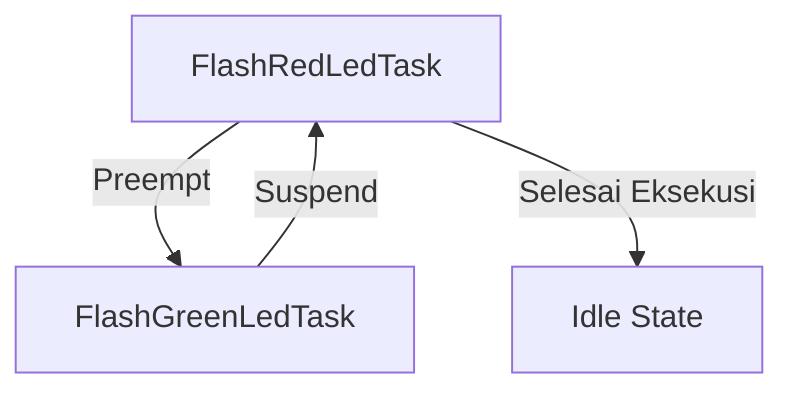

# Demonstrasi Perilaku Tugas dengan Kebijakan Penjadwalan Preemptive Prioritas

## Gambaran Proyek

Proyek ini bertujuan untuk memberikan pemahaman tentang bagaimana penjadwalan preemptive prioritas memengaruhi perilaku runtime tugas dalam sistem multitasking. Dua tugas digunakan untuk mengontrol LED, dengan prioritas berbeda, untuk menunjukkan efek preemptive.

## Deskripsi Proyek

Tugas `FlashGreenLedTask` dan `FlashRedLedTask` dirancang untuk menyalakan/mematikan LED dengan pola yang mencerminkan status eksekusi tugas. LED Hijau dan Merah menandakan waktu eksekusi tugas, sementara LED Biru dan Oranye menunjukkan status aktif atau siap.

### Tugas 1: FlashGreenLedTask
- **Deskripsi**: Menyalakan/mematikan LED Hijau dan Biru.
- **Prioritas**: Normal.
- **Langkah**:
  1. Nyalakan LED Biru.
  2. Simulasi eksekusi tugas dengan LED Hijau berkedip selama **4 detik**.
  3. Matikan LED Hijau dan LED Biru.
  4. Suspend tugas selama **6 detik**.

### Tugas 2: FlashRedLedTask
- **Deskripsi**: Menyalakan/mematikan LED Merah dan Oranye.
- **Prioritas**: Lebih tinggi dari FlashGreenLedTask.
- **Langkah**:
  1. Nyalakan LED Oranye.
  2. Simulasi eksekusi tugas dengan LED Merah berkedip selama **0.5 detik**.
  3. Matikan LED Merah dan LED Oranye.
  4. Suspend tugas selama **1.5 detik**.

### Mekanisme Preemptive
- Ketika FlashRedLedTask aktif, FlashGreenLedTask akan dipreempted (dihentikan sementara) jika sedang berjalan.
- Selama preemption, LED Hijau akan tetap dalam status terakhirnya (menyala atau mati) hingga eksekusi dilanjutkan.

## Hubungan Antar Tugas
- FlashRedLedTask memiliki prioritas lebih tinggi, sehingga dapat mempreempt FlashGreenLedTask.
- Pola nyala/mati LED menunjukkan preemption dan penjadwalan tugas.

## Diagram Alur Kerja

## Dokumentasi
https://github.com/user-attachments/assets/407a2a6a-e60c-49a6-81b2-237e31f9f22f

## Hasil Perilaku LED

### 1. **FlashGreenLedTask**
   - LED Biru menyala saat tugas aktif.
   - LED Hijau berkedip selama 4 detik saat tugas berjalan.

### 2. **FlashRedLedTask**
   - LED Oranye menyala saat tugas aktif.
   - LED Merah berkedip selama 0.5 detik saat tugas berjalan.
     
### 3. **Preemption**
   - Jika FlashRedLedTask aktif, FlashGreenLedTask akan berhenti sementara (LED Hijau tetap pada status terakhir).
